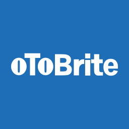

# Welcome to oToBrite community! 👋

oToBrite is a technology-driven team focusing on **image processing, computer vision, and AI applications** in real-world products.  
We build reliable software and hardware solutions that power automotive, robotics, and IoT systems.

Our mission is to provide high-performance, production-ready components that help partners accelerate development, deployment, and scaling of their vision-related products.

---

### Camera Drivers

#### Intel
- [oToCAM222_GMSL_ISX021_Intel](https://github.com/otobrite-support/oToCAM_GMSL_Intel)
- [oToCAM223_GMSL_ISX031_Intel](https://github.com/otobrite-support/oToCAM_GMSL_Intel)
#### NVIDIA
- [oToCAM222_GMSL_ISX021_NVIDIA](https://github.com/otobrite-support/oToCAM_GMSL_nVidia)
- [oToCAM223_GMSL_ISX031_NVIDIA](https://github.com/otobrite-support/oToCAM_GMSL_nVidia)
- [oToCAM260ISP_GMSL_IMX490_NVIDIA](https://github.com/otobrite-support/oToCAM_GMSL_nVidia)
- [oToCAM264ISP_GMSL_IMX390_NVIDIA](https://github.com/otobrite-support/oToCAM_GMSL_nVidia)
- [oToCAM271ISP_GMSL_IMX728_NVIDIA](https://github.com/otobrite-support/oToCAM_GMSL_nVidia)
- [oToCAM274ISP_GMSL_IMX623_NVIDIA](https://github.com/otobrite-support/oToCAM_GMSL_nVidia)
- [oToCAM276ISP_GMSL_AR0823AT_NVIDIA](https://github.com/otobrite-support/oToCAM_GMSL_nVidia)
- [oToCAM999ISP_GMSL_AR0823AT_NVIDIA](https://github.com/otobrite-support/oToCAM999ISP_GMSL_AR0823AT_NVIDIA)
### Source Files

(To be added soon...)

---

## Contact Us

- 📫 Email: [support@otobrite.com](mailto:support@otobrite.com)
- 🌐 Company Website: [www.otobrite.com](https://www.otobrite.com/)
- 🔗 LinkedIn: [oToBrite](https://www.linkedin.com/company/otobrite-electronics)

---

Thank you for your interest in **oToBrite**.  
If you are interested in collaboration, integration, or becoming a partner, feel free to reach out via email or our website.
